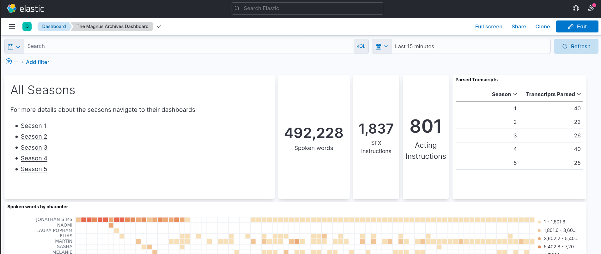
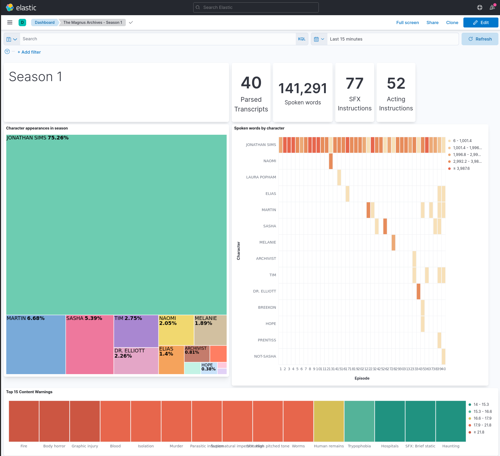

# The Magnus Archives Transcripts to Elasticsearch

This repository contains a simple python script to parse the 
[transcripts](https://rustyquillcom.sharepoint.com/:f:/g/EoErhOh-I9pGhHp49IpLUeoBL2O2AqOKWSMsIlTPVQtWYw) 
of [The Magnus Archives](https://rustyquill.com/show/the-magnus-archives/) and put them into elasticsearch
for data experiments.

The parser only supports the Word transcripts, not the PDF transcripts.

In some cases the parser will make mistakes as parsing Word documents is not an exact science ;-)

## Requirements

To run the parser and import the data into elasticsearch you need [docker](https://www.docker.com/) installed and the transcripts downloaded
and put in the folder [./transcripts](transcripts).

The parser is recursively getting all documents from the transcripts folder.

## Start elasticsearch and import transcripts

The provided docker-compose file spins up an elasticsearch node, 
a kibana node (for webaccess) and runs the importer script automatically.

```bash
# start elasticsearch, kibana and the parsing script
docker-compose up
```

## Accessing kibana

You can access kibana via [http://localhost:5601](http://localhost:5601).

From the Dashboard you can drill into the different seasons.


(The Magnus Archives Kibana Dashboard)



(The Magnus Archives Kibana Dashboard for Season 1)